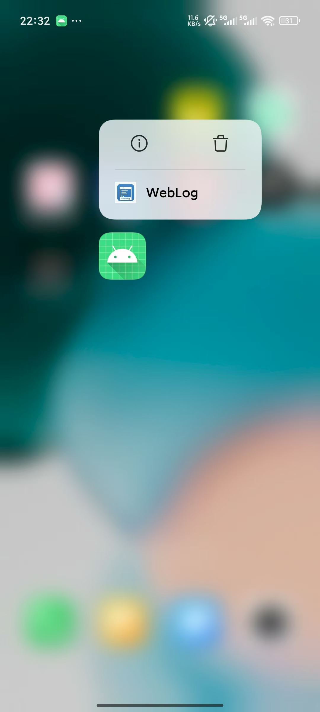
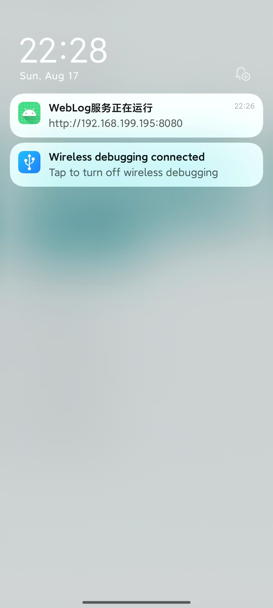
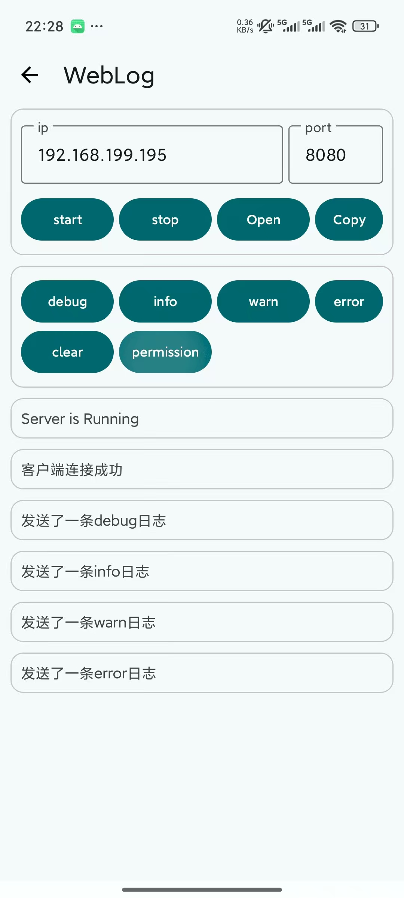
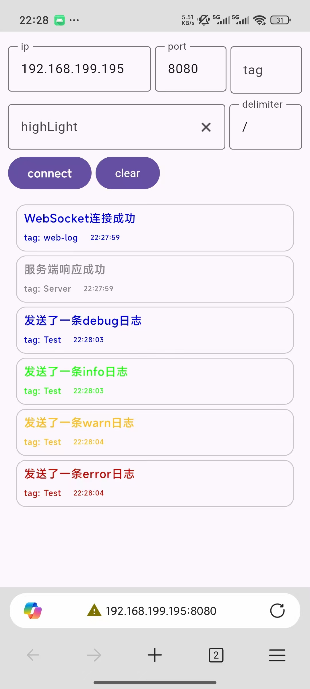
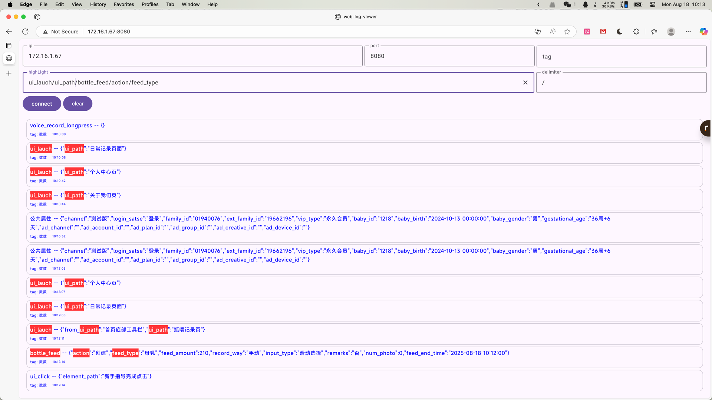

# WebLog

局域网查看Log神器。

|  |  |  |  |
|-------------------|---------------------------------|----------------------------|------------------------------|



## 导入依赖

```groovy
debugImplementation("com.github.simplepeng.web-log:library:0.1.0")
releaseImplementation("com.github.simplepeng.web-log:library-no-op:0.1.0")
```

就这样，然后启动App后，就会自动开启WebServer和SocketServer。

## 其他配置

如果你不想App启动时自动启动Server，可以在`AndroidManifest.xml`中配置：

```xml
<meta-data
    android:name="WebLogAutoStart"
    android:value="false" />
```

然后自己在合适的位置调用`WebLog.startServer`方法即可，要打开WebLog配置页面调用`WebLogPage.open`方法。

自启动的Server会开启一个`KeepRunningService`，它是一个前台Service，为了WebLog Server能长时间运行，所以请打开通知权限。

## 引用

WebLog Web页面是我使用[compose-multiplatform](https://github.com/JetBrains/compose-multiplatform)编写，如果你有局域网自部署需求或编译其他桌面应用需求，请查看源代码自行编译。

[web-log-viewer](https://github.com/simplepeng/web-log-viewer)

## 版本记录

* v0.1.0：第一个版本。